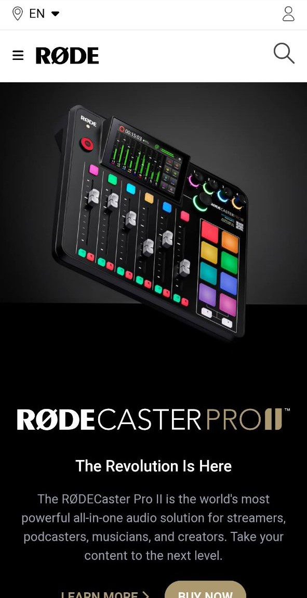

# RODE-Microphones | Rode-Clone   

### By Chhakuli

## 🔗Live Link -: [Rode-Clone](https://rode-microphones-clone.netlify.app/)
 

---
.png)

---

## What I learned from this Project

-i learned tailwind in more dept by this project .
- I learned how we can use just one one freamwork to create a beutiful website.
- Learned how it easy to make it responsive with framework.
## This project took around 10 hours to complete.

---

